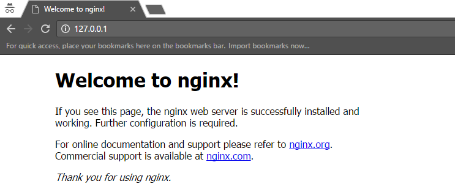

##Tutorial 1 - Compiling NGINX

###What are we doing?

We’ll be compiling NGINX for use as a test system.

###Why are we doing this?

When developing in a modern web application infrastructure you’ll often run into the requirement to support multiple plugins, features, and patching that may not be part of the package available via a package manager. It is therefore important to be able to create your own binary via the source distribution, typically provided directly by the author. Compiling from source will allow you the maximum level of control with a higher level of understand about the underlying technology, which is critical in a laboratory like setup.

###Step 1: Preparing the directory tree for the source code

This tutorial was prepared using Amazon Linux, but is designed to work on most distributions. Within this environment the location of where source code is stored isn’t fixed. The following is a recommendation based on the [File Hierarchy Standard](http://www.pathname.com/fhs/). The FHS defines the path structure of a Unix system; the structure for all stored files.

```bash
$> sudo mkdir /usr/src/nginx
$> sudo chown `whoami` /usr/src/nginx
$> cd /usr/src/nginx
```

###Step 2: Meeting the requirements for apr and apr-util

In order to compile any application a certain set of requirements for the language(s) in question must be met. Within this example we assume that you have the development toolchain configured, this exercise is left to the user as it can vary heavily. In our environment we installed G++, GCC, BinUtils, make and GPG. Nginx itself requires several external libraries as prerequisites in order to compile. We must first install the [PCRE](http://pcre.org/) engine before we are able to compile NGINX core. Perl Compatible Regular Expressions (PCRE) is a library that provides a set of functionality that allows for regular expression pattern matching in a manner similar to how it was provided as part of Perl. 
First download the PCRE source code package.

```bash
$> wget ftp://ftp.csx.cam.ac.uk/pub/software/programming/pcre/pcre-8.39.tar.gz
```

It is always best to verify your sources before using them to determine if they were successfully downloaded without corruption and to verify the integrity of the package. Many packages will provide a signatures that can be used to verify these facts. Using these provided files we can now verify our PCRE package.

```bash
$> wget ftp://ftp.csx.cam.ac.uk/pub/software/programming/pcre/Public-Key
$> wget ftp://ftp.csx.cam.ac.uk/pub/software/programming/pcre/pcre-8.39.tar.gz.sig
$> gpg --import Public-Key
$> gpg pcre-8.39.tar.gz.sig
gpg: Signature made Tue 14 Jun 2016 09:28:17 AM UTC using RSA key ID FB0F43D8
gpg: Good signature from "Philip Hazel <ph10@cam.ac.uk>" [unknown]
gpg:                 aka "Philip Hazel <ph10@cus.cam.ac.uk>" [unknown]
gpg: WARNING: This key is not certified with a trusted signature!
gpg:          There is no indication that the signature belongs to the owner.
Primary key fingerprint: 45F6 8D54 BBE2 3FB3 039B  46E5 9766 E084 FB0F 43D8
```

Seeing ‘Good signature’ indicates to us that we have obtained a good copy of our PCRE source code and we are ready to continue onto compiling it.

```bash
$> tar xvzf pcre-8.39.tar.gz
$> cd pcre-8.39
$> ./configure --prefix=/usr/local/pcre/
```

We unpack our PCRE source code and change into our new directory containing the extracted source. We will then use the configure script which will verify and configure the compiler for the subsequent task of compiling our source code. In this example we specify a prefix for PCRE to keep our system tidy, often the default choice is sufficient. If this command fails it likely means that you don’t have the necessary development tools installed. If it has completed successfully, we are ready to compile!

```bash
$> make
```

This takes a moment after which we get a number of compiled binaries, which we promptly install.

```bash
$> sudo make install
```

Another prerequisite for NGINX is [zlib](http://zlib.net/). NGINX requires this in order to support compression. We must first download the zlib source code package.

```bash
$> cd /usr/src/nginx
$> wget http://zlib.net/zlib-1.2.8.tar.gz
```

The MD5 checksum for the zlib package is provided directly on their site ([http://zlib.net](http://zlib.net)). For the 1.2.8 release the listed MD5 checksum is 44d667c142d7cda120332623eab69f40. We can verify this checksum by doing the following:

```bash
$> md5sum zlib-1.2.8.tar.gz
44d667c142d7cda120332623eab69f40  zlib-1.2.8.tar.gz
```

Seeing that the test has returned the same checksum as was listed on the site we are reasonably assured that it is the correct package, we must now continue to unpack and compile it.

```bash
$> tar -xzvf zlib-1.2.8.tar.gz
$> cd zlib-1.2.8
$> ./configure --prefix=/usr/local/zlib 
$> make
$> sudo make install
```

Once this has completed successfully we are ready to move onto building NGINX. It is important to note that if you are planning to use TLS, you are required to install OpenSSL as well.

###Step 3: Downloading the NGINX source code and verifying the checksum

We will now download the NGINX source code from the NGINX site ([http://nginx.org](http://nginx.org)). This can be done by downloading it directly from the [NGINX download page](https://nginx.org/en/download.html) or by using wget.

```bash
$> cd /usr/src/nginx
$> wget https://nginx.org/download/nginx-1.11.6.tar.gz
```

The compressed source code is approximately 1 MB in size.

Like all other packages the NGINX source code should be verified before it is extracted and compiled. To do this NGINX provides a GPG signature of the package they’ve released which you can from their website. You will also need the public key that was used to sign this signature which is available via the NGINX.org site [https://nginx.org/keys/nginx_signing.key](https://nginx.org/keys/nginx_signing.key) 

```bash
$> wget https://nginx.org/download/nginx-1.11.6.tar.gz.asc
$> wget http://nginx.org/keys/mdounin.key 
$? gpg --import mdounin.key
$> gpg --verify nginx-1.11.6.tar.gz.asc
gpg: assuming signed data in 'nginx-1.11.6.tar.gz'
gpg: Signature made Tue 15 Nov 2016 03:14:26 PM UTC using RSA key ID A1C052F8
gpg: Good signature from "Maxim Dounin <mdounin@mdounin.ru>" [unknown]
gpg: WARNING: This key is not certified with a trusted signature!
gpg:          There is no indication that the signature belongs to the owner.
Primary key fingerprint: B0F4 2533 73F8 F6F5 10D4  2178 520A 9993 A1C0 52F8
```

Assuming that we see ‘Good signature’ we are able to proceed to compiling and installing the package. 

###Step 4: Unpacking and configuring the compiler

After verification we can unpack the package.

```bash
$> tar xvzf nginx-1.11.6.tar.gz
```

We can now enter the directory and configure the compiler with our entries and with information about our system. :underline:`Note: if you are going to be installing ModSecurity 2.x you will need to compile the ModSecurity module (--add-module=/usr/src/modsecurity/nginx/modsecurity) see the next tutorial for more details.`

```bash
$> cd nginx-1.11.6
$> ./configure --prefix=/usr/local/nginx \
--with-pcre=/usr/src/nginx/pcre-8.39 \
--with-zlib=/usr/src/nginx/zlib-1.2.8 \
--sbin-path=/usr/local/nginx/nginx \
--conf-path=/usr/local/nginx/nginx.conf \
--pid-path=/usr/local/nginx/nginx.pid \
--with-stream --with-threads --with-file-aio
```

This is where we define the target directory for the future Apache web server, again compiling in compliance with the FHS. Following this, there are two options for linking the two libraries installed as a precondition. Subsequent to this we include various modules that enable additional features within NGINX such as TCP proxying (stream), threading, ipv6, and asynchronous file IO. Many of the enabled features take advantage of modern functionality or have a favorable impact on performance.

When compiling it is often the case that some components are missing. Installing packages is at times more difficult than in our case and versions may be incompatible in the worst case. There’s often a solution to the problem on the internet, but now and again you’ll have to dive really deep into the system to get to the root of the difficulties. This should not be an issue in our simple case.


###Step 5: Compiling

Once _configure_ is completed, we are ready to compile. At this point we should have very little trouble getting our code to compile, but it does infrequently happen.

```bash
$> make
```

This takes some time and 6.7 MB becomes just under 21 MB.

###Step 6: Installing

When compiling is successful, we can then install our NGINX web server, which we have successfully built ourselves. Installation must be performed by the super user. But right afterwards we’ll see how we can again take ownership of the web server. This is much more practical for a test system.

```bash
$> sudo make install
```

Installation may also take some time.

```bash
$> sudo chown -R `whoami` /usr/local/nginx
```

###Step 7: Starting

Now let’s see if our server will start up. This must be done as the super user. Since we installed NGINX to /usr/local/nginx/, our binaries will be located there. You can add this directory to the PATH if you would like to be able to call NGINX without specifying the whole path. 

```bash
$> sudo ./usr/local/nginx/nginx -g "daemon off;"
```

In the example above we are using the ‘-g’ option. This option allows a user to specify an additional configuration directive via the command line. The option we specified, “daemon off;”, tells Nginx not to start as a daemon running in the background. Running Nginx in the foreground will allow us to quickly start/stop it for testing purposes. However, for normal usage, to start Nginx as a daemon, just specify the executable with no arguments.

```bash
$> sudo ./usr/local/nginx/nginx
```

###Step 8: Trying it out

The engine is running. But is it also working? Time for the function test: We access Apache by entering the following URL in our browser:

[http://127.0.0.1/index.html](http://127.0.0.1/index.html)

We then expect the following:



NGINX indicates that it is installed correctly by displaying a default page

Fantastic! Goal achieved: You have compiled NGINX from source.

If you started Nginx with the ‘-g "daemon off;"’ option you can simply return to the shell and stop the server via CTRL-C. 

If you started Nginx as a daemon you may shut it down using the ‘-s quit’ option as shown below 

```bash
$> sudo ./usr/local/nginx/nginx -s quit
```

###Step 9 (Bonus): Checking Nginx version and compilation parameters.

Before completing the tutorial let’s take a closer look at some of our server’s settings. We can get some information about any compiled Nginx instance using the following:
```bash
$> ./usr/local/nginx/nginx -V
```

```bash
nginx version: nginx/1.11.6
built by gcc 4.8.3 20140911 (Red Hat 4.8.3-9) (GCC)
configure arguments: --prefix=/usr/local/nginx --with-pcre=/usr/src/nginx/pcre-8.39 --with-zlib=/usr/src/nginx/zlib-1.2.8 --sbin-path=/usr/local/nginx/nginx --conf-path=/usr/local/nginx/nginx.conf --pid-path=/usr/local/nginx/nginx.pid --with-stream --with-threads --with-file-aio
```

Using this argument we are able to see what version of Nginx is running along with the arguments that were passed to the configuration script while compiling it. The most important arguments for us will be the ‘--conf-path’, which references the location of the web server’s default configuration file and the ‘--prefix’ which lists the default location for the Nginx executable and logging directory.  This will also print out any optional components that were compiled into Nginx. We will see in the future that ModSecurity will be shown here if it has been compiled into Nginx. 

#####References
- Nginx: [http://www.nginx.org](http://www.nginx.org)
- File Hierarchy Standard: [http://www.pathname.com/fhs/](http://www.pathname.com/fhs/)
- NGINX compile-time options documentation: [https://www.nginx.com/resources/wiki/start/topics/tutorials/installoptions/](https://www.nginx.com/resources/wiki/start/topics/tutorials/installoptions/)


### License / Copying / Further use

<a rel="license" href="http://creativecommons.org/licenses/by-nc-sa/4.0/"></a><br />This work is licensed under a <a rel="license" href="http://creativecommons.org/licenses/by-nc-sa/4.0/">Creative Commons Attribution-NonCommercial-ShareAlike 4.0 International License</a>.


